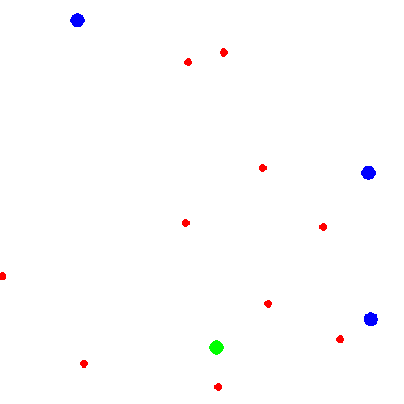

# SimpleAgarGNN
Hi CS 224W staff! Thank you for taking the time to look at our project.
To start, run `. ./setup.sh` to set up the conda environment.
Next, run `python main.py --show --model=gnn --env=greedy`

If you see something like this, you're good to go!

## Overview
For our final CS 224W project, we wanted to use graph neural networks with reinforcement learning. The game of agar.io — in which circular blobs compete to grow the largest by consuming pellets and each other — seemed a perfect application. To make the game easier to learn, we made several modifications to the original game:
- restricted the move space to 5 possible actions: no-op, up, down, left, and right
- removed the split and eject actions
- shrunk the map size
- reduced the number of players to 1-4
- reduced the number of pellets to 10
- reduced frame rate to 10 fps

With these modifications and using REINFORCE for training, we were able to train an MLP model to perform comparably to a greedy agent in the pellet collection environment, but results with our Heterogenous GNN were far less promising. Potential future improvements may include:
- parallelizing episodes to stabilize training
- using more powerful reinforcement learning algorithms (e.g., Actor-Critic, DQN, PPO, etc)
- filtering graph edges based on distance or via pooling
- allowing the GNN to learn node and edge features
- incorporating attention (either learned or proportional to 1/dist)

Unfortunately, we weren't able to explore these during the project. The sequential and time-intensive nature of RL training made experimentation difficult.

For more details about the project and its results, check out (TODO: link medium article)

To train the GNN model yourself in a self-learning environment, run `python main.py --train --model=gnn --env=sel --episodes=1000000`. To view the model's progress, run `tensorboard --logdir=runs` and open up the provided local address in any browser.

## Repository Guide
Everything in this repository can be controlled using `main.py`:
- to train a model, run `python main.py --train <arguments>`
- to test an agent, run `python main.py --test <arguments>`
- to display an agent for one episode, run `python main.py --show <arguments>`

### Command Line Arguments
- `--env=['pellet', 'greedy', 'self']`, required: the type of simple agar environment to run in
    - 'pellet': collect as many pellets as possible without competition from other players
    - 'greedy': fight to consume pellets and survive against greedy opponents that always move toward the closest pellet
    - 'self': control all agents simultaneously in this multi-agent self-learning environment 
- `--agent=['learning', 'greedy', 'random']`, optional (default: 'learning'): the type of agent to run
- `--model=['mlp', 'gnn']`, optional, the type of model used by a learning agent
- `--episodes`, optional (default: 10000000), the number of episodes to run for training or testing
- `--k_pellet`, optional (default: -1), the maximum number of pellet locations and masses provided as input to the mlp model
- `--k_player`, optional (default: -1), the maximum number of player locations and masses provided as input to the mlp model

### Files and Directories
- `simple_agar`:
    - `envs` contains the base gymnasium environment and endpoints used to make experimental environments
    - `wrapper` contains environment wrappers
    - `agents` contains baseline agents and learning agent
- `models` contains the MLP and GNN models used to train the learning agent
- `constants.py` contains constants used throughout the repository
- `trainer.py` contains methods used to train the models
